<div align="center">

# 🎬 AWEmbyPush

**优雅的 Emby/Jellyfin 媒体库更新通知服务**

[](https://github.com/AWdress/AWEmbyPush/releases)
[](https://hub.docker.com/r/awdress/awembypush)
[](https://github.com/AWdress/AWEmbyPush/actions)
[](https://www.python.org/)
[](LICENSE)

[功能特性](#-功能特性) • [快速开始](#-快速开始) • [配置说明](#-配置说明) • [使用文档](#-使用文档) • [更新日志](#-更新日志)

</div>

---

## 📖 简介

**AWEmbyPush** 是一个基于 Webhooks 的智能媒体库通知服务，专为 Emby/Jellyfin Server 设计。当您的媒体库添加新内容时，它会自动获取详细的影片信息并通过多种渠道推送精美的通知卡片。

> 💡 基于 [Emby_Notifier](https://github.com/Ccccx159/Emby_Notifier) 项目优化，增强企业微信代理支持，对网盘挂载媒体库更加友好。

### ✨ 功能特性

<table>
<tr>
<td width="50%">

#### 🎯 核心功能
- ✅ 支持 **Emby Server** (4.8.0.80+)
- ✅ 支持 **Jellyfin Server**
- ✅ 自动获取 TMDB/TVDB 媒体信息
- ✅ 三种推送方式任选
- ✅ 精美的消息卡片展示

</td>
<td width="50%">

#### 📱 推送渠道
- 📲 **Telegram Bot** - 支持 Markdown 富文本
- 💼 **企业微信** - 图文卡片 + 代理支持
- 🔔 **Bark** - iOS 通知推送
- 🔄 支持多渠道同时推送

</td>
</tr>
</table>

### 🆕 最新更新 (v4.2.0)

- 🎉 **项目重命名为 AWEmbyPush**
- 🌐 **新增企业微信代理支持** (`WECHAT_PROXY_URL`)
  - 完美支持 2022年6月20日后创建的自建应用
  - 灵活配置代理服务器地址
- 🚀 优化启动信息展示
- 📦 改进 Docker 镜像构建流程

---

## 🚀 快速开始

### 前置要求

- ✅ Emby Server **4.8.0.80+** 或 Jellyfin Server
- ✅ [TMDB API Token](https://www.themoviedb.org/settings/api) (必需)
- ✅ 至少一种推送方式配置：Telegram / 企业微信 / Bark

### 🐳 Docker 部署 (推荐)

#### 方式一：Docker Run

```bash
docker run -d \
  --name awembypush \
  --restart unless-stopped \
  -p 8000:8000 \
  -e TMDB_API_TOKEN=你的TMDB_TOKEN \
  -e TG_BOT_TOKEN=你的TG_BOT_TOKEN \
  -e TG_CHAT_ID=你的TG_CHAT_ID \
  awdress/awembypush:latest
```

#### 方式二：Docker Compose

创建 `docker-compose.yml` 文件：

```yaml
version: '3'
services:
  awembypush:
    image: awdress/awembypush:latest
    container_name: awembypush
    restart: unless-stopped
    ports:
      - "8000:8000"
    environment:
      - TZ=Asia/Shanghai
      # 必填参数
      - TMDB_API_TOKEN=你的TMDB_TOKEN
      
      # Telegram 配置（可选）
      - TG_BOT_TOKEN=你的BOT_TOKEN
      - TG_CHAT_ID=你的CHAT_ID
      
      # 企业微信配置（可选）
      - WECHAT_CORP_ID=企业ID
      - WECHAT_CORP_SECRET=应用密钥
      - WECHAT_AGENT_ID=应用AgentID
      - WECHAT_USER_ID=@all
      - WECHAT_PROXY_URL=https://qyapi.weixin.qq.com  # 代理地址
      - WECHAT_MSG_TYPE=news_notice
      
      # Bark 配置（可选）
      - BARK_SERVER=https://api.day.app
      - BARK_DEVICE_KEYS=你的设备KEY
      
      # 日志配置（可选）
      - LOG_LEVEL=INFO
      - LOG_EXPORT=False
      - LOG_PATH=/var/tmp/awembypush/
```

启动服务：

```bash
docker-compose up -d
```

---

## ⚙️ 配置说明

### 📋 环境变量详解

#### 🔑 必填参数

| 参数 | 说明 | 获取方式 |
|------|------|----------|
| `TMDB_API_TOKEN` | TMDB API 读访问令牌 | [获取地址](https://www.themoviedb.org/settings/api) |

#### 📱 Telegram 配置 (可选)

| 参数 | 说明 | 默认值 |
|------|------|--------|
| `TG_BOT_TOKEN` | Telegram Bot Token | - |
| `TG_CHAT_ID` | 频道/群组 Chat ID | - |

<details>
<summary>💡 如何获取 Telegram 配置？</summary>

1. 与 [@BotFather](https://t.me/BotFather) 对话创建 Bot
2. 获取 `TG_BOT_TOKEN`
3. 将 Bot 添加到频道，使用 [@userinfobot](https://t.me/userinfobot) 获取 Chat ID

</details>

#### 💼 企业微信配置 (可选)

| 参数 | 说明 | 默认值 |
|------|------|--------|
| `WECHAT_CORP_ID` | 企业 ID | - |
| `WECHAT_CORP_SECRET` | 应用凭证密钥 | - |
| `WECHAT_AGENT_ID` | 应用 AgentID | - |
| `WECHAT_USER_ID` | 接收用户 ID | `@all` |
| `WECHAT_PROXY_URL` | 🆕 消息代理地址 | `https://qyapi.weixin.qq.com` |
| `WECHAT_MSG_TYPE` | 消息类型 | `news_notice` |

> ⚠️ **重要提示**：2022年6月20日后创建的自建应用需要配置 `WECHAT_PROXY_URL` 代理地址！

<details>
<summary>💡 企业微信配置说明</summary>

- **消息类型**：支持 `news` (图文) 和 `news_notice` (模板卡片)
- **代理地址**：如使用第三方代理服务，请将 `WECHAT_PROXY_URL` 设置为代理服务器地址
- **接收范围**：`@all` 表示推送给所有成员，也可指定特定用户 ID

</details>

#### 🔔 Bark 配置 (可选)

| 参数 | 说明 | 默认值 |
|------|------|--------|
| `BARK_SERVER` | Bark 服务地址 | `https://api.day.app` |
| `BARK_DEVICE_KEYS` | 设备密钥（逗号分隔） | - |

#### 📝 其他配置 (可选)

| 参数 | 说明 | 默认值 |
|------|------|--------|
| `TVDB_API_KEY` | TVDB API Key | - |
| `LOG_LEVEL` | 日志等级 | `INFO` |
| `LOG_EXPORT` | 是否导出日志文件 | `False` |
| `LOG_PATH` | 日志文件路径 | `/var/tmp/awembypush` |

---

## 📚 使用文档

### 🎬 Emby Server 配置

<details>
<summary>点击展开配置步骤</summary>

#### 1️⃣ 添加 Webhooks

进入 **Emby Server 控制台** → **设置** → **通知** → **添加 Webhooks**

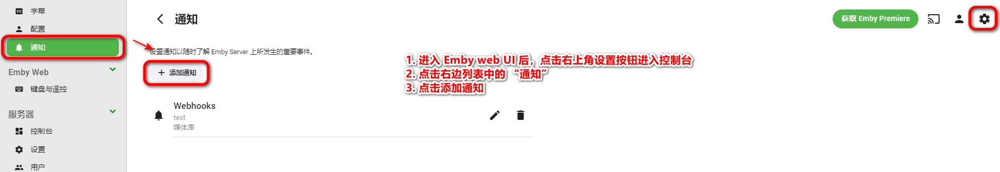

#### 2️⃣ 配置 Webhooks URL

- **Webhook URL**: `http://你的服务器IP:8000`
- **数据类型**: `application/json`

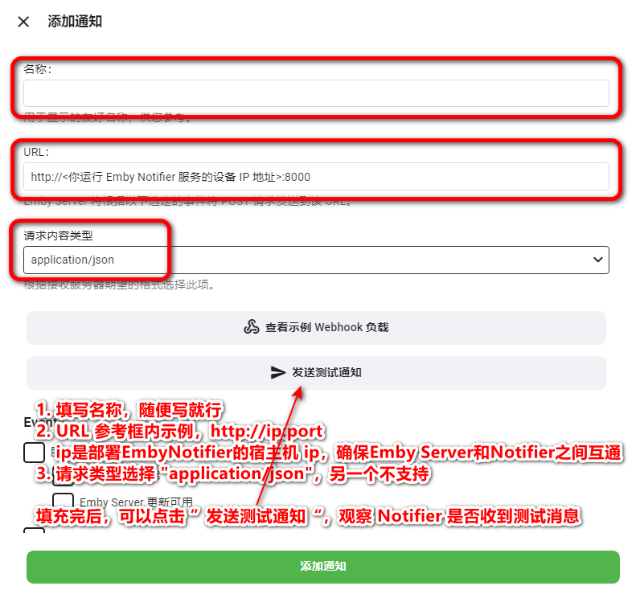

#### 3️⃣ 测试连接

点击 **发送测试通知**，查看服务日志：

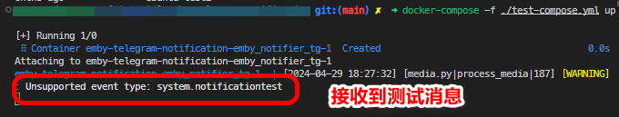

```log
[WARNING] : Unsupported event type: system.notificationtest
```

#### 4️⃣ 选择通知事件

选择 **媒体库** → **新媒体已添加**

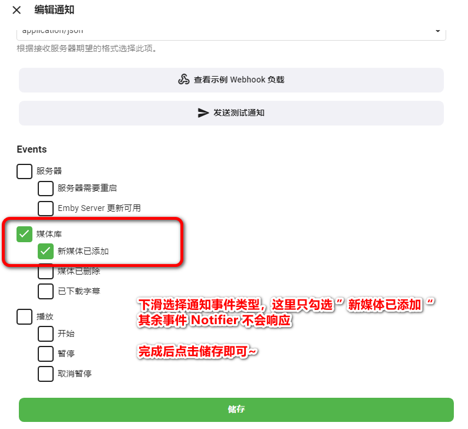

</details>

### 🎞️ Jellyfin Server 配置

<details>
<summary>点击展开配置步骤</summary>

#### 1️⃣ 安装 Webhooks 插件

进入 **Jellyfin 控制台** → **插件** → 搜索并安装 **Webhooks**

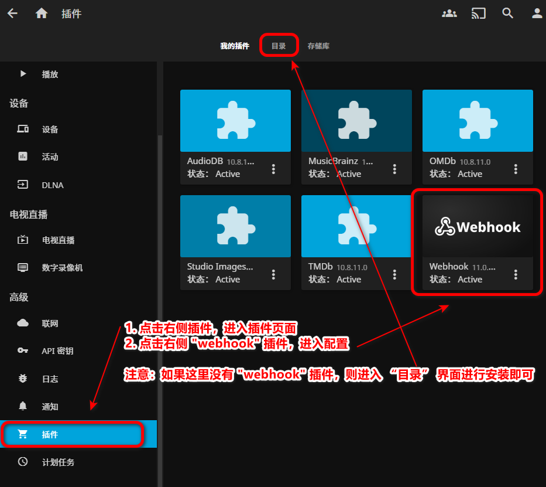

#### 2️⃣ 添加 Generic Destination

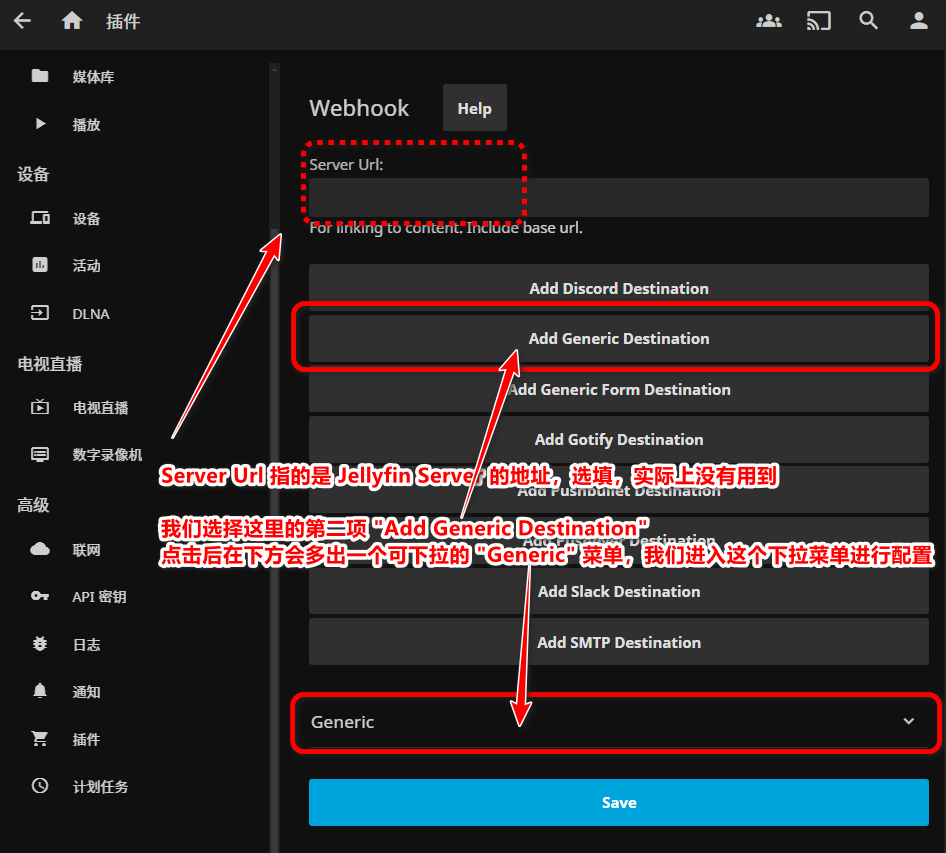

#### 3️⃣ 配置 Webhook

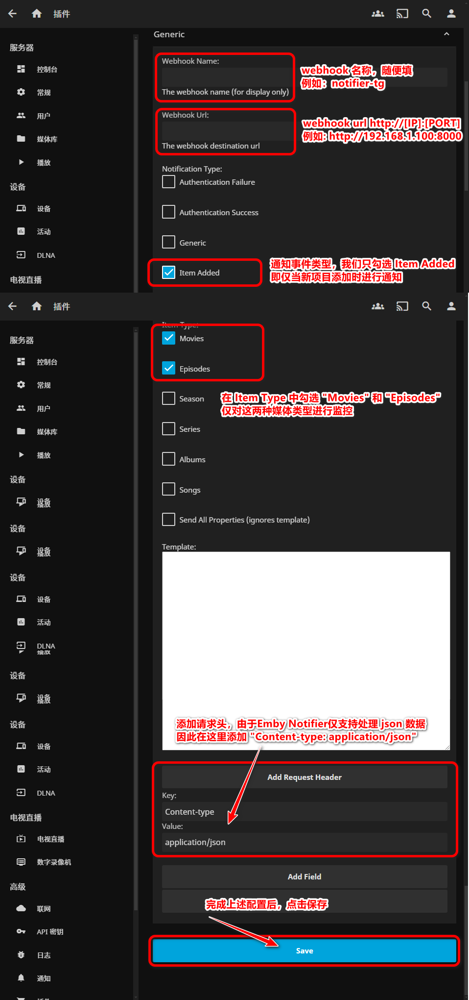

#### 4️⃣ 启用通知

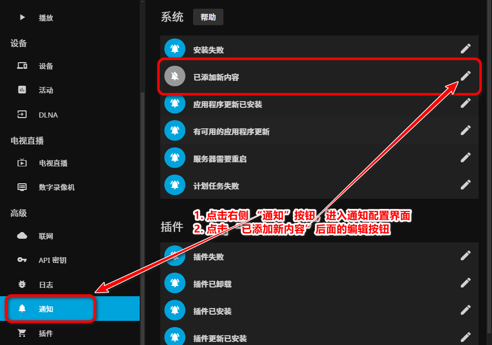

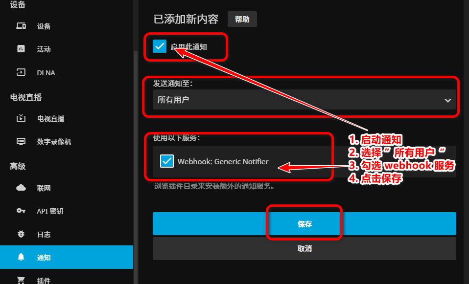

</details>

---

## 🎨 效果展示

<table>
<tr>
<td width="33%" align="center">

### 📱 Telegram


电影推送效果

</td>
<td width="33%" align="center">

### 💼 企业微信
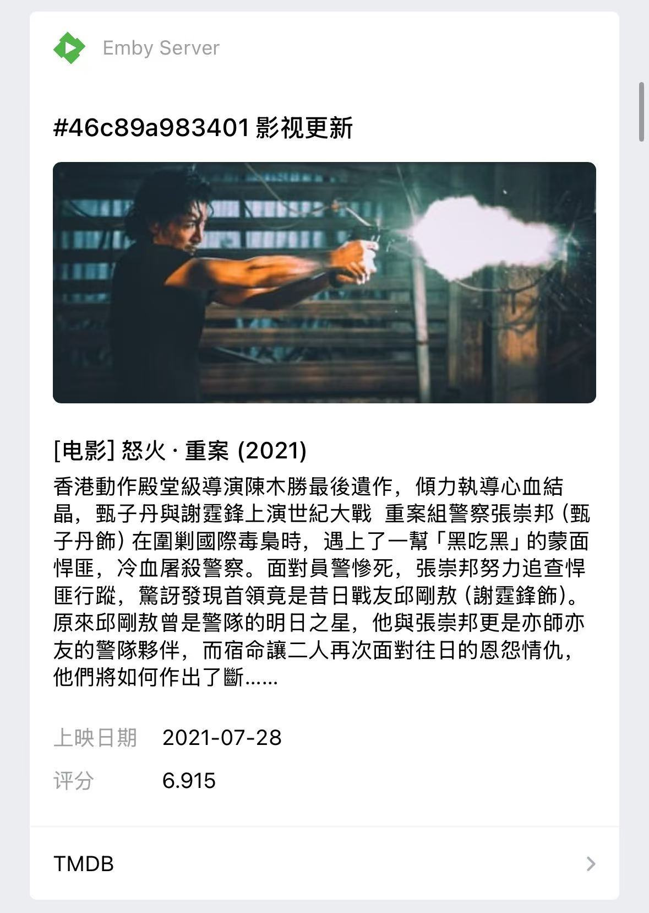

模板卡片展示

</td>
<td width="33%" align="center">

### 🔔 Bark
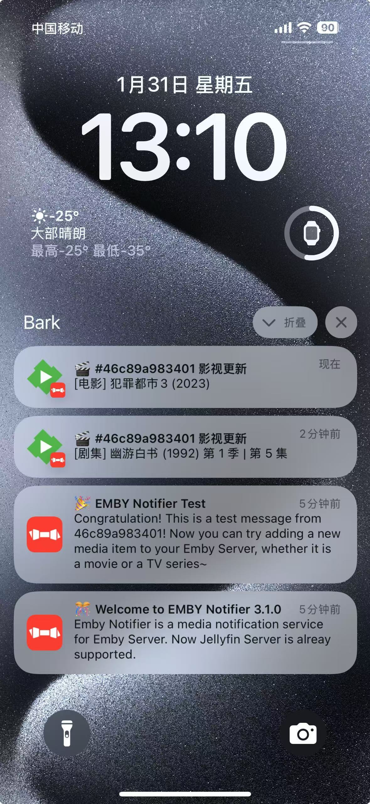

iOS 通知推送

</td>
</tr>
</table>

---

## 📊 工作流程

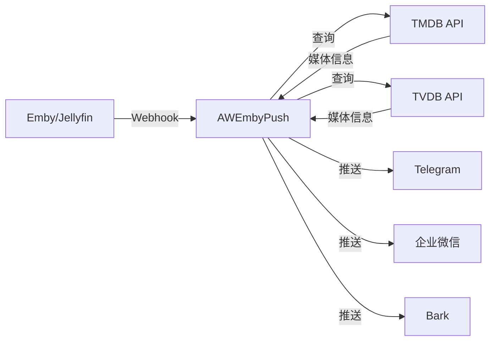

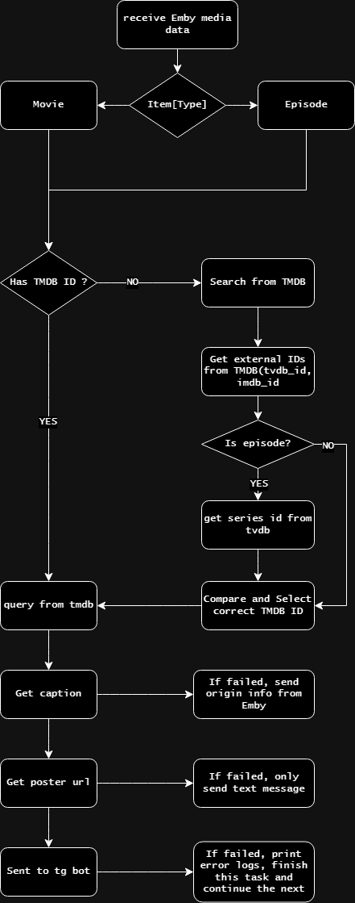

---

## 📝 更新日志

### 🎉 v4.2.0 (2025-10-21)

- 🆕 新增企业微信代理功能支持 (`WECHAT_PROXY_URL`)
- 🎨 项目重命名为 AWEmbyPush
- ✨ 更新启动信息和项目标识
- 🐳 优化 Docker 镜像构建流程

<details>
<summary>查看历史版本</summary>

### v4.1.0 (2025-04-10)
- 微信增加图文消息类型支持
- 优化 TVDB_API_KEY 未配置时的处理逻辑
- 修复 BARK_DEVICE_KEYS 未配置时启动报错

### v4.0.0 (2025-01-31)
- 新增 Bark 推送支持

### v3.0.0 (2024-07-29)
- 新增企业微信支持

### v2.0.0 (2024-05-17)
- 支持 Jellyfin Server

[查看完整更新日志](CHANGELOG.md)

</details>

---

## ⚠️ 注意事项

### Emby Server 版本要求

> 🔴 **需要 Emby Server 4.8.0.80 或更高版本**

- ✅ **4.8.0.80+**：Webhooks 功能内置于控制台"通知"功能
- ❌ **4.8.0.80 以下**：需要激活 Emby Premiere 才能使用 Webhooks

> 💡 **群晖用户注意**：套件中心版本较旧，请从 [Emby 官网](https://emby.media/download.html)下载最新版本手动安装。

### 局限性

- 通知推送依赖 Emby/Jellyfin 的文件监视和媒体库扫描机制
- 如果服务器未及时触发新媒体添加事件，则无法推送通知

---

## 🤝 贡献者

感谢以下开发者的贡献：

- 原作者：[xu4n_ch3n](https://github.com/Ccccx159) - [Emby_Notifier](https://github.com/Ccccx159/Emby_Notifier)
- 贡献者：xiaoQQya
- 当前维护：[Awhitedress](https://github.com/AWdress)

---

## 📚 参考文档

- 📖 [TMDB API 文档](https://developers.themoviedb.org/3)
- 🤖 [Telegram Bot API](https://core.telegram.org/bots/api)
- 💼 [企业微信 API](https://developer.work.weixin.qq.com/document/path/90664)
- 🔔 [Bark 文档](https://bark.day.app/#/)

---

## 📄 License

本项目基于 MIT 协议开源

---

<div align="center">

**如果这个项目对你有帮助，欢迎 Star ⭐**

Made with ❤️ by [Awhitedress](https://github.com/AWdress)

</div>
